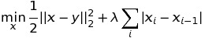
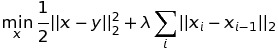
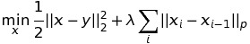
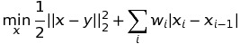
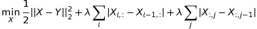
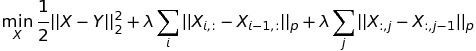
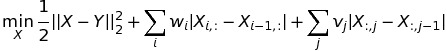
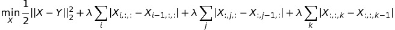
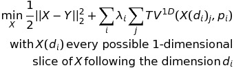
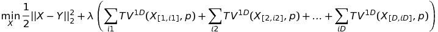

#proxTV

Matlab and Python toolbox for fast Total Variation proximity operators.

For an up-to-date version, check https://github.com/albarji/proxTV .

##Index

1. Introduction
2. Referencing
3. Matlab interface
  1. Quickstart
  2. Installation
  3. Usage
  4. Examples
4. Python interface
  1. Quickstart
  2. Installation
  3. Usage
5. Demos
5. Contact
6. Acknowledgements

##Introduction

**proxTV** is a toolbox implementing blazing fast implementations of Total Variation proximity operators. While the core algorithms are implemented in C to achieve high efficiency, Matlab and Python interfaces are provided for ease of use.

The library provides efficient solvers for the following Total Variation proximity problems:

| Problem | Formulation |
| ------- | ----------- |
| Standard (l1) Total Variation on a 1-dimensional signal |  |
| Quadratic (l2) Total Variation on a 1-dimensional signal |  |
| lp-norm Total Variation on a 1-dimensional signal |  |
| Weighted Total Variation on a 1-dimensional signal |  |
| Anisotropic Total Variation on a 2-dimensional signal |  |
| lp-norm Anisotropic Total Variation on a 2-dimensional signal |  |
| Weighted Anisotropic Total Variation on a 2-dimensional signal |  |
| Anisotropic Total Variation on a 3-dimensional signal |  |
| Generalized N-dimensional Anisotropic Total Variation | , with X(di) every possible 1-dimensional slice of X following dimension di.|

##Referencing

If you find this toolbox useful please reference the following papers:

* Fast Newton-type Methods for Total Variation Regularization. Álvaro Barbero, Suvrit Sra. ICML 2011 proceedings.
    
* Modular proximal optimization for multidimensional total-variation regularization. Álvaro Barbero, Suvrit Sra. http://arxiv.org/abs/1411.0589
    
whose Bibtex entries are

    @inproceedings{conf/icml/Barbero11,
      added-at = {2011-12-16T00:00:00.000+0100},
      author = {Barbero, \'Alvaro and Sra, Suvrit},
      biburl = {http://www.bibsonomy.org/bibtex/214ce9f5c15d1d462bd264d8af9e4c3c7/dblp},
      booktitle = {ICML},
      crossref = {conf/icml/2011},
      editor = {Getoor, Lise and Scheffer, Tobias},
      interhash = {5d6359b6c7f4d0fb6de36aada6827a3e},
      intrahash = {14ce9f5c15d1d462bd264d8af9e4c3c7},
      keywords = {dblp},
      pages = {313-320},
      publisher = {Omnipress},
      timestamp = {2011-12-16T00:00:00.000+0100},
      title = {Fast Newton-type Methods for Total Variation Regularization.},
      url = {http://dblp.uni-trier.de/db/conf/icml/icml2011.html#JimenezS11},
      year = 2011
    }
    
    @Article{barberoTV14,
      Title                    = {Modular proximal optimization for multidimensional total-variation regularization},
      Author                   = {\'Alvaro Barbero and Suvrit Sra},
      Year                     = {2014},
      Url                      = {http://arxiv.org/abs/1411.0589}
    }

##Matlab interface

###Quick start guide

To install proxTV just type "install" at the Matlab prompt once located at proxTV folder. If any problem arises please refer to the "Installation" section in this file.

After that the TV solver can be invoked easily through the general purpose "TV" function. For instance,

    TV(X,lambda)
    
solves TV for X signal and lambda regularizer. The dimensionality of X is automatically checked and an adequate solver is applied.

To solve TV for a general TV-Lp norm just add the value of p as a third argument,

    TV(X,lambda,p)
    
Weighted versions of TV can also be solved by using exactly the same interface, but providing a vector of lambda weights instead of a scalar. For multidimensional signals the relevant weights are provided as a cell array; the "Usage" section for more detailts on this and more advanced uses of toolbox.

###Installation

To install proxTV follow the steps:

1. Open Matlab.
2. Change directory to the folder where this README file is located.
3. Type: "install"
4. After compilation the message "proxTV successfully installed" will appear. If instead an error message shows up, check your mex compiler configuration (type "mex -setup"). If the error was produced by the "openmp" library, you might need to install it, or you can install proxTV with no multi-thread features by typing "install(1)". 
5. The install script automatically adds the relevant proxTV folders to your Matlab path. If this were to fail for some reason, you should manually add the /matlab subfolder to your Matlab path. You can do this e.g. by using the "pathtool()" utility. You may also add the /matlab/demos subfolder to try out the included demos.

*Note*: this interface has only been tested under Linux. Installation might require LAPACK (http://www.netlib.org/lapack/) and BLAS (http://www.netlib.org/blas/) libraries.

###Usage

Two main functions conform the Matlab interface of proxTV: **TV** and **TVgen**. The first one provides basic options over the Total Variation problem, while the second one allows a more advanced configuration. In general, the TV function should suffice for most uses.

####TV

Solves Total Variation proximity operators for n-dimensional signals, applying a TV-Lp norm. The inputs and outputs of this function are:

    [x,info] = TV(y,lambda,p,threads)

Inputs
* y: input of the proximity operator.
* lambda: premultiplier of the norm.
* (Optional) p: norm. Default is p = 1.
* (Optional) threads: number of threads (default 1). Used only for 2-D or higher-dimensional signals.

Outputs
* x: solution of the proximity problem.
* info: statistical info of the run algorithm:
  * info.iters: number of iterations run (major iterations for the 2D case)
  * info.stop: value of the stopping criterion.
       
For 1-dimensional signals the problem solved is

    
Using p=1 results in the standard Total Variation regularizer, which generates a "blocky" reconstruction of the signal. Using p=2 instead produces a smoother reconstruction.

For 2-dimensional signals (e.g. images) the problem solved is

    
where X(i,:) is i-th row of X and X(:,j) is the j-th column of X. Using p=1 results in an anisotropic denoising filter.

For D-dimensional signals the problem being solved becomes
    

    
where X[d,i] is the i-th 1-dimensional fiber of X along its d-th dimension, and TV1D denotes the standard 1-dimensional Total Variation penalty applied over such fiber.

If a vector of weights *w* is provided for the lambda parameter instead of an scalar value, the special weighted version of TV is solved,

    
were each difference among signal entries x_i and x_(i-1) is penalized using a different weight w_i.

In the case of 2D signals the weighted problem is

    
Weight matrices are provided in the TV function as the lambda parameter through a cell array in the form {w, v} (see the examples in the "Examples" section)

####TVgen

Solves a generalized TV proximity operator for a multidimensional signal, in the form
    

, with X(di) every possible 1-dimensional slice of X following dimension di.
    
The inputs and outputs of this function are:

    [x,info] = TVgen(y,lambdas,ds,norms,threads)

Inputs:
* y: input signal.
* lambdas: vector of lambda penalties of each penalty term.
* ds: vector of dimensions of application of each penalty term.
* norms: vector of norms of each penalty term.
* (Optional) threads: number of threads to use (default: 1)

Outputs:
* x: solution of the proximity problem.
* info: statistical info of the run algorithm:
  * info.iters: number of major iterations run.
  * info.stop: value of the stopping criterion.
       
When possible, TV should be preferred. See the Examples section next for some specific examples on using this function.

###Examples

####1D examples

Filter 1D signal using TV-L1 norm:

    TV(x,lambda)
    
Filter 1D signal using weighted TV-L1 norm (for x vector of length N, weights vector of length N-1)

    TV(x,weights)
    
Filter 1D signal using TV-L2 norm:

    TV(x,lambda,2)
    
Filter 1D signal using both TV-L1 and TV-L2 norms:

    TVgen(X,[lambda1 lambda2],[1 1],[1 2])
    
####2D examples

Filter 2D signal using TV-L1 norm:

    TV(X,lambda)
    
or
        
    TVgen(X,[lambda lambda],[1 2],[1 1])

Filter 2D signal using TV-L2 norm:

    TV(X,lambda,2)
    
or

    TVgen(X,[lambda lambda],[1 2],[2 2])
    
Filter 2D signal using 4 parallel threads (last argument):

    TV(X,lambda,1,4)
    
or

    TVgen(X,[lambda lambda],[1 2],[1 1],4)

Filter 2D signal using TV-L1 norm for the rows, TV-L2 for the columns, and different penalties:

    TVgen(X,[lambdaRows lambdaCols],[1 2],[1 2])
    
Filter 2D signal using both TV-L1 and TV-L2 norms:

    TVgen(X,[lambda1 lambda1 lambda2 lambda2],[1 2 1 2],[1 1 2 2])
    
Filter 2D signal using weighted TV-L1 norm (for X image of size MxN, W1 weights of size (M-1)xN, W2 weights of size Mx(N-1))

    TV(X, {W1, W2})
    
####3D examples

Filter 3D signal using TV-L1 norm:

    TV(X,lambda)
    
or

    TVgen(X,[lambda lambda lambda],[1 2 3],[1 1 1])

Filter 3D signal using TV-L2 norm, not penalizing over the second dimension:

    TVgen(X,[lambda lambda],[1 3],[2 2])

## Python interface

### Quickstart

You can install the latest version of proxTV through **pip** running

    pip install prox-tv
    
Please note that some prerequisites might not be installed in your system. In case of failure during pip install, refer to the Prerequisites section.

If you want to install from source, please refere to the Installation section.

###Installation

####Prerequisites

To use proxTV within Python the following prerequisites are necessary

- **cffi**: https://cffi.readthedocs.org/en/latest/
- **numpy**: http://www.numpy.org/

You can install **cffi** through **pip**:

    pip install cffi
  
Be aware that other packages might be required to install cffi, such as **python-dev** and **libffi-dev**. For a full list of dependencies please refer to cffi documentation (https://cffi.readthedocs.org/en/latest/).

Additionally, in order to generate the toolbox documentation the following packages are needed as well:

- **sphinxcontrib-napoleon**
- **sphinx_rtd_theme**

Finally, if you would like to run the provided demos you will also require the following packages:

* **matplotlib**: http://matplotlib.org/
* **scipy**: http://www.scipy.org/
* **scikit-image**: http://scikit-image.org/

####Manually installing proxTV Python package

After prerequisites have been satisfied, just run

    python setup.py install
    
on the folder where this README file is located. You might need superuser permissions for a correct installation.

####Generating docs

Documentation is available only at http://pythonhosted.org/prox_tv/. Nevertheless if you would like to compile the docs yourself you just need to run

    make html
    
in the docs/ folder. The documentation will be generated in the doc/_build/html/index.html file.

###Usage

Import proxTV Python package as

    import prox_tv as ptv
    
or

    from prox_tv import *
    
for direct access to all the package routines.
    
The documentation of use of the package functions is maintained online at http://pythonhosted.org/prox_tv/.

##Demos

Some demos in the form of both Matlab and Python scripts showing how to work with proxTV are included in the subfolders /matlab/demos and /prox_tv/demos, respectively. They are:

- **demo_filter_signal**: TV-L1, TV-L2 and weighted TV-L1 filtering of 1-dimensional signals.
- **demo_filter_image**: TV-L1 filtering of 2-dimensional image.
- **demo_filter_image_color**: TV-L1 filtering of 3-dimensional image (length, width and color).
- **demo_filter_image_threads**: multi-thread TV-L1 filtering of 2-dimensional image.
- **demo_filter_image_weighted**: weighted TV-L1 filtering of 2-dimensional image.

## Contact

For any questions and comments, please email alvaro.barbero@uam.es

## Acknowledgements

We wish to thank the following people for helping us in debugging and extending the toolbox:

- **Zico Kolter** for pointing out a bug in our Projected Newton method.
- **Sesh Kumar** for spotting and correcting a bug in our weighted 1D-TV method.
- **Josip Djolonga** for implementing the Python bindings.
